# Intune - Self-Improving LLM Evaluation Framework

An end-to-end framework for training, evaluating, and iteratively improving Large Language Models with automated feedback loops.

[](https://www.python.org/downloads/)
[](https://fastapi.tiangolo.com/)
[](https://reactjs.org/)
[](LICENSE)
[]()

---

## 👥 Team Members

| Name                      | Roll Number | GitHub Profile |
|---------------------------|-------------|----------------|
| Radhakrishna Bharuka      | 24BDS063    | [@RK0297](https://github.com/RK0297) |
| Abhang Pawar              | 24BDS054    | [@abhangpawar](https://github.com/abhangpawar) |
| Nilesh Dwivedi            | 24BDS048    | [@nilesh](https://github.com/nilesh) |
| Rushikesh Masalkar        | 24BDS040    | [@rushikesh](https://github.com/rushikesh) |

---

## 📑 Table of Contents

- [Project Overview](#project-overview)
- [Demo Video](#demo-video)
- [Key Features](#key-features)
- [Technology Stack](#technology-stack)
- [Repository Structure](#repository-structure)
- [System Architecture](#system-architecture)
- [Workflows](#workflows)
- [Installation & Setup](#installation--setup)
- [Configuration](#configuration)
- [Usage Instructions](#usage-instructions)
- [Code Examples](#code-examples)
- [API Documentation](#api-documentation)
- [Deployment](#deployment)
- [Testing](#testing)
- [Troubleshooting](#troubleshooting)
- [Contributing](#contributing)
- [License](#license)
- [Acknowledgments](#acknowledgments)

---

## 🎯 Project Overview

### What is Intune?

Intune is a comprehensive framework that enables **self-improving Large Language Models** through automated training, evaluation, and refinement cycles. The system continuously learns from user interactions and improves its performance without manual intervention.

### High-Level Overview

The framework implements a **closed-loop improvement system** where:

1. **Users interact** with the AI through a web interface
2. **Responses are generated** using a base LLM (Gemma 1B)
3. **Quality metrics** are computed automatically (8 distinct metrics)
4. **Training data** is accumulated from interactions
5. **Fine-tuning** triggers automatically when thresholds are met
6. **Improved model** replaces the base model
7. **Cycle repeats** for continuous improvement

### Key Capabilities

✅ **Automated Data Collection** - Captures user interactions in real-time  
✅ **Comprehensive Evaluation** - 8 metrics covering relevancy, precision, recall, faithfulness, toxicity, and hallucinations  
✅ **Efficient Fine-tuning** - LoRA adapters enable training on consumer GPUs (8GB+ VRAM)  
✅ **Background Processing** - Workers handle evaluation and training asynchronously  
✅ **Quantifiable Improvements** - Before/after comparison with detailed reports  
✅ **Scalable Architecture** - Microservices design with separate frontend, backend, and workers  

---

## 🎬 Demo Video

### 2-Minute Working Application Demo

[](https://github.com/Self-eval-llm/Intune-Backend/blob/main/docs/demo_video.mp4)

**Video Preview:**


**Demo Highlights:**
- 🎨 User interface walkthrough
- 💬 Real-time chat interactions with the AI
- 📊 Live metric computation visualization
- 🔄 Background worker operations
- 📈 Before/after performance comparison
- 🚀 Complete end-to-end workflow

---

## ✨ Key Features

### 1. Automated Training Pipeline


- **Continuous Learning:** System learns from every interaction
- **Smart Triggers:** Fine-tuning activates based on configurable thresholds
- **Data Validation:** Automatic quality checks before training
- **Incremental Updates:** Preserves previous knowledge while learning new patterns

### 2. Comprehensive 8-Metric Evaluation System

| Metric | Type | Range | Description |
|--------|------|-------|-------------|
| Answer Relevancy | Positive | 0-1 | How relevant the answer is to the question |
| Contextual Precision | Positive | 0-1 | Answer content supported by context |
| Contextual Recall | Positive | 0-1 | Context coverage in the answer |
| Contextual Relevancy | Positive | 0-1 | Semantic similarity between context and answer |
| Faithfulness | Positive | 0-1 | Alignment with reference and context |
| Toxicity | Negative | 0-1 | Presence of harmful language |
| Hallucination Rate | Negative | 0-1 | Unsupported information |
| Overall Score | Aggregate | 0-1 | Balanced combination of all metrics |

### 3. Efficient LoRA-Based Fine-tuning

- **Memory Efficient:** Runs on 8GB VRAM GPUs (RTX 4060+)
- **Fast Training:** 3 epochs complete in ~15-30 minutes
- **Checkpoint System:** Auto-save every 100 steps
- **Adapter Merging:** Seamless integration with base model

### 4. Background Worker Architecture

- **Worker 1 (eval_first):** Computes base model metrics
- **Worker 2 (eval_finetune):** Handles training and final evaluation
- **Asynchronous Processing:** Non-blocking operations
- **Fault Tolerant:** Automatic retry on failures

---

## 🛠 Technology Stack

### Frontend

| Technology | Version | Purpose |
|-----------|---------|---------|
| **React** | 18+ | UI framework |
| **TypeScript** | 5+ | Type-safe JavaScript |
| **Vite** | 5+ | Build tool and dev server |
| **Tailwind CSS** | 3+ | Utility-first styling |
| **Axios** | 1.6+ | HTTP client |

### Backend

| Technology | Version | Purpose |
|-----------|---------|---------|
| **Python** | 3.10+ | Core programming language |
| **FastAPI** | 0.104+ | Web framework |
| **Uvicorn** | 0.24+ | ASGI server |
| **Pydantic** | 2.0+ | Data validation |

### Machine Learning

| Technology | Version | Purpose |
|-----------|---------|---------|
| **Ollama** | Latest | Local LLM inference |
| **Gemma** | 1B | Base language model |
| **GPT-OSS** | 20B | Teacher model |
| **Unsloth** | Latest | Fast fine-tuning |
| **LoRA** | - | Parameter-efficient training |
| **Transformers** | 4.36+ | Model loading and inference |
| **PyTorch** | 2.1+ | Deep learning framework |

### Database & Infrastructure

| Technology | Version | Purpose |
|-----------|---------|---------|
| **Supabase** | Cloud | PostgreSQL database |
| **CUDA** | 12.1+ | GPU acceleration |
| **Git Submodules** | - | Multi-repo management |

---

## 📁 Repository Structure

### Main Repository (Intune)

```
RK0297/Intune/
│
├── .gitmodules                    # Submodule configuration
├── .vscode/                       # VS Code settings
├── README.md                      # This file
│
├── Intune-Frontend/              # [SUBMODULE] React frontend
│   ├── src/
│   │   ├── components/           # React components
│   │   ├── pages/                # Page components
│   │   ├── services/             # API service layer
│   │   ├── hooks/                # Custom React hooks
│   │   ├── utils/                # Utility functions
│   │   └── App.tsx               # Root component
│   ├── public/                   # Static assets
│   ├── package.json              # Node dependencies
│   ├── tsconfig.json             # TypeScript config
│   ├── vite.config.ts            # Vite configuration
│   └── tailwind.config.js        # Tailwind CSS config
│
├── Intune_Backend/               # [SUBMODULE] Main backend (Ollama)
│   ├── app/
│   │   ├── app.py                # FastAPI server (Port 8000)
│   │   ├── eval_first.py         # Worker 1: Base evaluation
│   │   └── eval_finetune.py      # Worker 2: Fine-tuning
│   ├── src/
│   │   ├── data_generation/      # Training data pipeline
│   │   │   ├── teacher.py        # Generate reference answers
│   │   │   ├── student.py        # Generate base outputs
│   │   │   └── prepare_data.py   # Format for training
│   │   ├── training/
│   │   │   └── finetune.py       # LoRA fine-tuning logic
│   │   ├── evaluation/
│   │   │   ├── update_metrics.py # Compute base metrics
│   │   │   └── evaluate_finetuned.py # Final evaluation
│   │   ├── metrics/
│   │   │   └── llm_eval.py       # 8 metrics implementation
│   │   └── database/
│   │       └── supabase_client.py # Database interface
│   ├── docs/
│   │   ├── AI_report.pdf         # Technical documentation
│   │   ├── demo_video.mp4        # Working demo
│   │   └── *.png                 # Diagrams and screenshots
│   ├── sql/
│   │   └── *.sql                 # Database schemas
│   ├── requirements.txt          # Python dependencies
│   └── .env                      # Environment variables
│
└── Intune_OpenAI_Backend/        # [SUBMODULE] OpenAI alternative backend
    ├── app/
    │   └── app.py                # FastAPI with OpenAI integration
    ├── src/
    │   └── openai_client.py      # OpenAI API wrapper
    └── requirements.txt          # Python dependencies
```

### Submodule Repositories

| Submodule | Repository URL | Purpose |
|-----------|---------------|---------|
| **Intune-Frontend** | [Self-eval-llm/Intune-Frontend](https://github.com/Self-eval-llm/Intune-Frontend) | React-based web interface |
| **Intune_Backend** | [Self-eval-llm/Intune-Backend](https://github.com/Self-eval-llm/Intune-Backend) | Main backend with Ollama |
| **Intune_OpenAI_Backend** | [Self-eval-llm/Intune_OpenAI_Backend](https://github.com/Self-eval-llm/Intune_OpenAI_Backend) | Alternative OpenAI backend |

---

## 🏗 System Architecture

### Component Interaction Diagram


### Network Architecture


---

## 🔄 Workflows

### 1. User Interaction Workflow


### 2. Evaluation Workflow


### 3. Fine-tuning Workflow

```mermaid
flowchart TD
    A[Worker 2 Starts] --> B{Check Record Count}
    B -->|< 5000| C[Wait 60 seconds]
    C --> B
    B -->|≥ 5000| D[Prepare Training Data]
    D --> E[Export to JSONL]
    E --> F[Split Train/Val 90/10]
    F --> G[Load Gemma Model]
    G --> H[Apply LoRA Adapters]
    H --> I[Train 3 Epochs]
    I --> J[Save Checkpoints]
    J --> K[Merge Adapters]
    K --> L[Export to GGUF]
    L --> M[Deploy to Ollama]
    M --> N[Evaluate Fine-tuned Model]
    N --> O[Update Database]
    O --> P[Generate Report]
    P --> Q[End]
```



### 4. Complete Self-Improvement Loop


### 5. Data Flow Pipeline


### 6. CI/CD Workflow (GitHub Actions - Example)


---

## 🚀 Installation & Setup

### Prerequisites

Before starting, ensure you have:

| Requirement | Minimum | Recommended | Check Command |
|------------|---------|-------------|---------------|
| **Python** | 3.10 | 3.11+ | `python --version` |
| **Node.js** | 18 | 20 LTS | `node --version` |
| **npm** | 9 | 10+ | `npm --version` |
| **GPU** | 8GB VRAM | 12GB+ VRAM | `nvidia-smi` |
| **RAM** | 16GB | 32GB | - |
| **Disk** | 50GB free | 100GB+ free | - |
| **Git** | 2.30+ | Latest | `git --version` |

---

### Step 1: Clone Repository with Submodules

```bash
# Clone the main repository with all submodules
git clone --recursive https://github.com/RK0297/Intune.git
cd Intune

# If you already cloned without --recursive, initialize submodules:
git submodule update --init --recursive
```

**Verify submodules:**

```bash
# Check submodule status
git submodule status

# Expected output:
# <commit-hash> Intune-Frontend (heads/main)
# <commit-hash> Intune_Backend (heads/main)
# <commit-hash> Intune_OpenAI_Backend (heads/main)
```

---

### Step 2: Set Up Backend (Intune_Backend)

```bash
cd Intune_Backend

# Create virtual environment
python -m venv .venv

# Activate virtual environment
# Windows PowerShell:
.\.venv\Scripts\Activate.ps1
# Linux/Mac:
source .venv/bin/activate

# Install dependencies
pip install --upgrade pip
pip install -r requirements_finetune.txt
```

---

### Step 3: Set Up Frontend (Intune-Frontend)

```bash
cd ../Intune-Frontend

# Install Node dependencies
npm install

# Verify installation
npm list --depth=0
```

---

### Step 4: Install Ollama

**Windows:**

```powershell
# Using winget
winget install Ollama.Ollama

# Or download from https://ollama.ai/download
```

**Linux:**

```bash
curl -fsSL https://ollama.ai/install.sh | sh
```

**macOS:**

```bash
brew install ollama
```

**Start Ollama service:**

```bash
ollama serve
```

**Pull required models:**

```bash
# Pull base model (1.5GB)
ollama pull gemma3:1b

# Pull teacher model (20GB - optional, for data generation)
ollama pull gpt-oss:20b

# Verify
ollama list
```

---

### Step 5: Set Up Database (Supabase)

**5.1 Create Supabase Project:**

1. Go to [supabase.com](https://supabase.com)
2. Sign up / Log in
3. Click "New Project"
4. Fill in project details
5. Wait for provisioning (~2 minutes)

**5.2 Get API Credentials:**

1. Navigate to **Settings** → **API**
2. Copy **Project URL**
3. Copy **anon/public key**

**5.3 Run SQL Scripts:**

Open **SQL Editor** in Supabase Dashboard and execute in order:

```sql
-- 1. Create main table
-- Run: Intune_Backend/sql/supabase_setup.sql

-- 2. Add metric columns
-- Run: Intune_Backend/sql/supabase_add_metrics.sql

-- 3. Add fine-tuned columns
-- Run: Intune_Backend/sql/add_tuned_columns.sql

-- 4. (Optional) Create decimal view
-- Run: Intune_Backend/sql/create_decimal_view.sql
```

---

## ⚙️ Configuration

### Backend Configuration (.env)

Create `.env` file in `Intune_Backend/`:

```bash
cd Intune_Backend
cp config/.env.example .env
```

**Edit `.env`:**

```env
# ======================
# SUPABASE CONFIGURATION
# ======================
SUPABASE_URL=https://your-project-id.supabase.co
SUPABASE_KEY=your-anon-or-service-key

# ======================
# MODEL CONFIGURATION
# ======================
DEFAULT_MODEL=gemma3:1b
TEACHER_MODEL=gpt-oss:20b
FINE_TUNED_MODEL=gemma-finetuned

# ======================
# TRAINING CONFIGURATION
# ======================
FINE_TUNE_THRESHOLD=5000
BATCH_SIZE=4
LEARNING_RATE=2e-4
NUM_EPOCHS=3
MAX_SEQ_LENGTH=2048

# ======================
# WORKER CONFIGURATION
# ======================
EVAL_FIRST_POLL_INTERVAL=5
EVAL_FINETUNE_CHECK_INTERVAL=60

# ======================
# API CONFIGURATION
# ======================
API_HOST=0.0.0.0
API_PORT=8000
CORS_ORIGINS=http://localhost:5173,http://localhost:3000

# ======================
# LOGGING
# ======================
LOG_LEVEL=INFO
```

### Frontend Configuration

Create `.env` file in `Intune-Frontend/`:

```env
# API Endpoint
VITE_API_URL=http://localhost:8000

# Environment
VITE_ENV=development
```

### Environment Variables Reference

| Variable | Default | Description |
|----------|---------|-------------|
| `SUPABASE_URL` | - | Supabase project URL (required) |
| `SUPABASE_KEY` | - | Supabase API key (required) |
| `DEFAULT_MODEL` | `gemma3:1b` | Base model name |
| `FINE_TUNE_THRESHOLD` | `5000` | Records needed to trigger training |
| `EVAL_FIRST_POLL_INTERVAL` | `5` | Seconds between evaluation checks |
| `API_PORT` | `8000` | Backend server port |
| `VITE_API_URL` | `http://localhost:8000` | Backend URL for frontend |

---

## 🎮 Usage Instructions

### Running the Complete System

The application requires **4 separate terminal windows** running simultaneously.

---

#### Terminal 1: Backend API Server

```bash
cd Intune_Backend
.\.venv\Scripts\Activate.ps1  # Windows
# source .venv/bin/activate    # Linux/Mac

python -m uvicorn app.app:app --host 0.0.0.0 --port 8000 --reload
```

**Expected Output:**
```
INFO:     Uvicorn running on http://0.0.0.0:8000
INFO:     Application startup complete.
```

**Endpoints Available:**
- API Root: `http://localhost:8000`
- Swagger Docs: `http://localhost:8000/docs`
- Health Check: `http://localhost:8000/health`

---

#### Terminal 2: Evaluation Worker

```bash
cd Intune_Backend
.\.venv\Scripts\Activate.ps1  # Windows
# source .venv/bin/activate    # Linux/Mac

python app\eval_first.py
```

**Expected Output:**
```
INFO: Starting First Evaluation Worker...
INFO: Polling interval: 5 seconds
INFO: Found 3 records to evaluate
INFO: Evaluating record 123
INFO: Updated record 123 (Answer Relevancy: 0.7532)
```

---

#### Terminal 3: Fine-tuning Worker

```bash
cd Intune_Backend
.\.venv\Scripts\Activate.ps1  # Windows
# source .venv/bin/activate    # Linux/Mac

python app\eval_finetune.py
```

**Expected Output:**
```
INFO: Starting Fine-tuning Worker...
INFO: Checking conditions every 60 seconds
INFO: Records collected: 47 / 5000 (0.94%)
INFO: Threshold not reached. Waiting...
```

---

#### Terminal 4: Frontend Server

```bash
cd Intune-Frontend

npm run dev
```

**Expected Output:**
```
VITE v5.0.0  ready in 500 ms

➜  Local:   http://localhost:5173/
➜  Network: http://192.168.1.100:5173/
```

**Access the app:** Open `http://localhost:5173` in your browser

---

### Using the Web Interface

1. **Open Browser:** Navigate to `http://localhost:5173`
2. **Enter Question:** Type your question in the chat input
3. **View Response:** AI-generated answer appears in real-time
4. **Check Metrics:** View evaluation scores (if implemented in UI)
5. **Continue Chatting:** System learns from each interaction

---

### Using the API Directly

#### Method 1: curl (Command Line)

```bash
curl -X POST http://localhost:8000/generate \
  -H "Content-Type: application/json" \
  -d '{"prompt": "What is machine learning?"}'
```

#### Method 2: PowerShell

```powershell
$body = @{
    prompt = "Explain neural networks"
} | ConvertTo-Json

Invoke-RestMethod -Uri http://localhost:8000/generate `
  -Method Post `
  -Body $body `
  -ContentType "application/json"
```

#### Method 3: Python Script

```python
import requests

response = requests.post(
    "http://localhost:8000/generate",
    json={"prompt": "What is deep learning?"}
)

print(response.json())
```

**Expected Response:**

```json
{
  "response": "Deep learning is a subset of machine learning...",
  "model": "gemma3:1b",
  "timestamp": "2025-11-16T15:30:45Z",
  "record_id": 12345
}
```

---

## 💻 Code Examples

### Example 1: Making API Requests

```python
# src/example_api_client.py
import requests
from typing import Dict, Any

class IntuneClient:
    def __init__(self, base_url: str = "http://localhost:8000"):
        self.base_url = base_url
    
    def generate_response(self, prompt: str) -> Dict[str, Any]:
        """Generate a response from the LLM"""
        response = requests.post(
            f"{self.base_url}/generate",
            json={"prompt": prompt},
            timeout=30
        )
        response.raise_for_status()
        return response.json()
    
    def health_check(self) -> Dict[str, Any]:
        """Check API health"""
        response = requests.get(f"{self.base_url}/health")
        return response.json()

# Usage
client = IntuneClient()
result = client.generate_response("What is AI?")
print(f"Response: {result['response']}")
print(f"Model: {result['model']}")
```

### Example 2: Computing Metrics Programmatically

```python
# src/example_metrics.py
from src.metrics.llm_eval import LLMEvaluator

# Initialize evaluator
evaluator = LLMEvaluator()

# Prepare evaluation data
question = "What is photosynthesis?"
answer = "Photosynthesis is the process by which plants convert sunlight into energy."
context = ["Plants use chlorophyll to absorb light", "CO2 and water are inputs"]
reference = "Photosynthesis converts light energy into chemical energy in plants."

# Compute metrics
metrics = evaluator.evaluate(
    question=question,
    answer=answer,
    context=context,
    expected_output=reference
)

# Display results
print(f"Answer Relevancy: {metrics['answer_relevancy']:.4f}")
print(f"Faithfulness: {metrics['faithfulness']:.4f}")
print(f"Toxicity: {metrics['toxicity']:.4f}")
print(f"Overall Score: {metrics['overall_score']:.4f}")
```

### Example 3: Database Operations

```python
# src/example_database.py
from src.database.supabase_client import get_supabase_client

# Get database client
supabase = get_supabase_client()

# Insert new record
data = {
    "input": "What is quantum computing?",
    "actual_output": "Quantum computing uses quantum mechanics...",
    "expected_output": "Quantum computing leverages superposition...",
    "context": ["Quantum mechanics", "Superposition", "Entanglement"],
    "status_eval_first": "created"
}

result = supabase.table("intune_db").insert(data).execute()
print(f"Inserted record ID: {result.data[0]['id']}")

# Query records
records = supabase.table("intune_db")\
    .select("*")\
    .eq("status_eval_first", "created")\
    .limit(10)\
    .execute()

print(f"Found {len(records.data)} records pending evaluation")
```

### Example 4: Fine-tuning Entry Point

```python
# src/example_finetune.py
from src.training.finetune import fine_tune_model
from src.data_generation.prepare_data import prepare_training_data

# Step 1: Prepare data
train_file, val_file = prepare_training_data(
    output_dir="./training_data",
    train_split=0.9
)

print(f"Training data: {train_file}")
print(f"Validation data: {val_file}")

# Step 2: Fine-tune
fine_tune_model(
    model_name="unsloth/gemma-1b",
    train_file=train_file,
    val_file=val_file,
    output_dir="./models/gemma-finetuned",
    epochs=3,
    batch_size=4,
    learning_rate=2e-4
)

print("Fine-tuning complete!")
```

---

## 📚 API Documentation

### Endpoints

#### `GET /`

**Description:** Root endpoint providing API information

**Response:**
```json
{
  "message": "Intune API - Self-Improving LLM Framework",
  "version": "1.0.0",
  "endpoints": ["/generate", "/health"]
}
```

---

#### `GET /health`

**Description:** Health check endpoint

**Response:**
```json
{
  "status": "healthy",
  "database": "connected",
  "ollama": "running",
  "timestamp": "2025-11-16T15:30:45Z"
}
```

---

#### `POST /generate`

**Description:** Generate a response from the LLM

**Request Body:**
```json
{
  "prompt": "What is machine learning?",
  "model": "gemma3:1b",  // Optional
  "max_tokens": 500      // Optional
}
```

**Response:**
```json
{
  "response": "Machine learning is a method of data analysis...",
  "model": "gemma3:1b",
  "timestamp": "2025-11-16T15:30:45Z",
  "record_id": 12345,
  "tokens_used": 87
}
```

**Status Codes:**
- `200`: Success
- `400`: Invalid request body
- `500`: Server error
- `503`: Ollama service unavailable

---

### Interactive API Documentation

**Swagger UI:** `http://localhost:8000/docs`

- Interactive API testing
- Request/response schemas
- Try-it-out functionality

**ReDoc:** `http://localhost:8000/redoc`

- Clean, readable documentation
- Code examples in multiple languages

---

## 🐳 Deployment

### Docker Deployment (Recommended)

**Coming Soon** - Docker Compose configuration for one-command deployment

```yaml
# docker-compose.yml (Future)
version: '3.8'

services:
  backend:
    build: ./Intune_Backend
    ports:
      - "8000:8000"
    environment:
      - SUPABASE_URL=${SUPABASE_URL}
      - SUPABASE_KEY=${SUPABASE_KEY}
    
  frontend:
    build: ./Intune-Frontend
    ports:
      - "5173:5173"
    depends_on:
      - backend
  
  ollama:
    image: ollama/ollama:latest
    ports:
      - "11434:11434"
    volumes:
      - ollama-data:/root/.ollama
    
volumes:
  ollama-data:
```

---

### Local Production Deployment

**1. Build Frontend:**

```bash
cd Intune-Frontend
npm run build
```

**2. Serve Frontend:**

```bash
npm install -g serve
serve -s dist -l 3000
```

**3. Run Backend with Gunicorn:**

```bash
cd Intune_Backend
gunicorn app.app:app \
  --workers 4 \
  --worker-class uvicorn.workers.UvicornWorker \
  --bind 0.0.0.0:8000
```

**4. Set up Process Manager (PM2/systemd):**

```bash
# Using PM2
pm2 start app.app:app --name intune-backend --interpreter python
pm2 start "npm run dev" --name intune-frontend
pm2 save
pm2 startup
```

---

### Cloud Deployment

#### Option 1: AWS EC2

1. Launch EC2 instance (g4dn.xlarge for GPU)
2. Install dependencies
3. Configure security groups (ports 8000, 5173, 11434)
4. Set up Nginx reverse proxy
5. Use systemd for process management

#### Option 2: Google Cloud Platform

1. Create Compute Engine instance with GPU
2. Follow local installation steps
3. Configure firewall rules
4. Use Cloud Load Balancer

#### Option 3: Vercel (Frontend only)

```bash
cd Intune-Frontend
vercel deploy
```

---

## 🧪 Testing

### Running Tests

**Backend Tests:**

```bash
cd Intune_Backend
pytest tests/ -v --cov=src
```

**Frontend Tests:**

```bash
cd Intune-Frontend
npm run test
```

---

### Manual Testing Checklist

- [ ] API server starts without errors
- [ ] Frontend loads at localhost:5173
- [ ] Can send query and receive response
- [ ] Response is stored in database
- [ ] eval_first worker computes metrics
- [ ] Metrics appear in database
- [ ] Fine-tuning triggers at threshold
- [ ] Fine-tuned model deploys successfully
- [ ] Final evaluation completes
- [ ] Comparison report generated

---

### Load Testing

```bash
# Install Apache Bench
sudo apt install apache2-utils

# Test API endpoint
ab -n 1000 -c 10 -p query.json -T application/json \
  http://localhost:8000/generate
```

---

## 🔧 Troubleshooting

### Common Issues and Solutions

#### Issue 1: Ollama Connection Failed

**Symptoms:**
```
Error: Could not connect to Ollama at http://localhost:11434
```

**Solutions:**

```bash
# Check if Ollama is running
curl http://localhost:11434/api/tags

# If not running, start it
ollama serve

# Verify models are installed
ollama list

# If models missing, pull them
ollama pull gemma3:1b
```

---

#### Issue 2: Supabase Connection Failed

**Symptoms:**
```
Error: Invalid API key or URL
```

**Solutions:**

1. Verify `.env` file exists in `Intune_Backend/`
2. Check credentials in Supabase Dashboard
3. Test connection:

```python
python -c "from src.database.supabase_client import get_supabase_client; print(get_supabase_client())"
```

4. Ensure firewall allows outbound HTTPS to Supabase

---

#### Issue 3: Worker Not Processing Records

**Symptoms:**
```
INFO: Found 0 records to evaluate
```

**Solutions:**

1. Check database has records:

```bash
# Query Supabase
```

2. Verify status flags:

```sql
SELECT status_eval_first, COUNT(*) 
FROM intune_db 
GROUP BY status_eval_first;
```

3. Manually set status:

```sql
UPDATE intune_db 
SET status_eval_first = 'created' 
WHERE id = 123;
```

---

#### Issue 4: GPU Out of Memory

**Symptoms:**
```
torch.cuda.OutOfMemoryError: CUDA out of memory
```

**Solutions:**

1. Reduce batch size in `.env`:

```env
BATCH_SIZE=2  # Reduce from 4
```

2. Reduce max sequence length:

```env
MAX_SEQ_LENGTH=1024  # Reduce from 2048
```

3. Clear GPU cache:

```python
import torch
torch.cuda.empty_cache()
```

---

#### Issue 5: Fine-tuning Not Triggering

**Symptoms:**
```
INFO: Records collected: 4999 / 5000 (99.98%)
```

**Solutions:**

1. Check exact record count:

```sql
SELECT COUNT(*) FROM intune_db WHERE status_eval_first = 'done';
```

2. Lower threshold temporarily:

```env
FINE_TUNE_THRESHOLD=10  # For testing
```

3. Manually trigger (for testing):

```bash
python src/training/finetune.py
```

---

#### Issue 6: Frontend Cannot Connect to Backend

**Symptoms:**
```
Network Error: Failed to fetch
```

**Solutions:**

1. Verify backend is running on port 8000
2. Check CORS configuration in `app/app.py`:

```python
app.add_middleware(
    CORSMiddleware,
    allow_origins=["http://localhost:5173"],
    allow_credentials=True,
    allow_methods=["*"],
    allow_headers=["*"],
)
```

3. Verify `.env` in frontend:

```env
VITE_API_URL=http://localhost:8000
```

---

### Debug Mode

**Enable detailed logging:**

```env
LOG_LEVEL=DEBUG
```

**View logs:**

```bash
# Backend logs
tail -f logs/app.log

# Worker logs
tail -f logs/eval_first.log
tail -f logs/eval_finetune.log
```

---

### Getting Help

If you're still experiencing issues:

1. **Check existing issues:** [GitHub Issues](https://github.com/RK0297/Intune/issues)
2. **Create new issue:** Include logs, system info, and steps to reproduce
3. **Join discussions:** [GitHub Discussions](https://github.com/RK0297/Intune/discussions)

---

## 🤝 Contributing

We welcome contributions from the community!

### How to Contribute

1. **Fork the repository**

```bash
# Click "Fork" on GitHub
# Clone your fork
git clone https://github.com/YOUR_USERNAME/Intune.git
```

2. **Create a feature branch**

```bash
git checkout -b feature/your-feature-name
```

3. **Make your changes**

- Follow existing code style
- Add tests for new features
- Update documentation

4. **Commit your changes**

```bash
git add .
git commit -m "feat: add your feature description"
```

**Commit Message Convention:**

- `feat:` New feature
- `fix:` Bug fix
- `docs:` Documentation changes
- `style:` Code style changes (formatting)
- `refactor:` Code refactoring
- `test:` Adding tests
- `chore:` Maintenance tasks

5. **Push to your fork**

```bash
git push origin feature/your-feature-name
```

6. **Create Pull Request**

- Go to original repository
- Click "New Pull Request"
- Select your branch
- Fill in PR template

---

### Development Guidelines

**Code Style:**

- **Python:** Follow PEP 8, use Black formatter
- **TypeScript:** Follow Airbnb style guide, use ESLint/Prettier
- **SQL:** Use uppercase for keywords

**Testing:**

- Write unit tests for new functions
- Maintain >80% code coverage
- Test edge cases

**Documentation:**

- Update README for new features
- Add docstrings to functions
- Include code examples

---

### Areas We Need Help

- 🐛 Bug fixes
- ✨ New evaluation metrics
- 🎨 UI/UX improvements
- 📝 Documentation improvements
- 🌐 Internationalization
- 🧪 Test coverage
- 🚀 Performance optimizations

---

## 📄 License

This project is licensed under the **MIT License**.

```
MIT License

Copyright (c) 2025 Radhakrishna Bharuka, Abhang Pawar, Nilesh Dwivedi, Rushikesh Masalkar

Permission is hereby granted, free of charge, to any person obtaining a copy
of this software and associated documentation files (the "Software"), to deal
in the Software without restriction, including without limitation the rights
to use, copy, modify, merge, publish, distribute, sublicense, and/or sell
copies of the Software, and to permit persons to whom the Software is
furnished to do so, subject to the following conditions:

The above copyright notice and this permission notice shall be included in all
copies or substantial portions of the Software.

THE SOFTWARE IS PROVIDED "AS IS", WITHOUT WARRANTY OF ANY KIND, EXPRESS OR
IMPLIED, INCLUDING BUT NOT LIMITED TO THE WARRANTIES OF MERCHANTABILITY,
FITNESS FOR A PARTICULAR PURPOSE AND NONINFRINGEMENT. IN NO EVENT SHALL THE
AUTHORS OR COPYRIGHT HOLDERS BE LIABLE FOR ANY CLAIM, DAMAGES OR OTHER
LIABILITY, WHETHER IN AN ACTION OF CONTRACT, TORT OR OTHERWISE, ARISING FROM,
OUT OF OR IN CONNECTION WITH THE SOFTWARE OR THE USE OR OTHER DEALINGS IN THE
SOFTWARE.
```

---

## 🙏 Acknowledgments

### Technologies

- **[Gemma](https://ai.google.dev/gemma)** by Google - Base language model
- **[Ollama](https://ollama.ai/)** - Local LLM inference infrastructure
- **[Unsloth](https://github.com/unslothai/unsloth)** - 2x faster fine-tuning library
- **[FastAPI](https://fastapi.tiangolo.com/)** - Modern Python web framework
- **[React](https://reactjs.org/)** - Frontend UI library
- **[Supabase](https://supabase.com/)** - Open-source Firebase alternative

### Inspiration

- Research papers on self-improving AI systems
- Open-source LLM evaluation frameworks
- LoRA paper: "LoRA: Low-Rank Adaptation of Large Language Models"

### Community

- Thanks to all contributors and testers
- Special thanks to the open-source community

---
### Support Channels

- **GitHub Issues:** [Report bugs](https://github.com/RK0297/Intune/issues)
- **GitHub Discussions:** [Ask questions](https://github.com/RK0297/Intune/discussions)
- **Email:** intune-support@example.com

---

## 📊 Project Status


**Current Version:** 1.0.0  
**Last Updated:** November 16, 2025  
**Status:** ✅ Active Development

### Roadmap

- [x] Core evaluation system
- [x] Automated fine-tuning
- [x] Web interface
- [ ] Docker deployment
- [ ] Multi-model support
- [ ] Real-time monitoring dashboard
- [ ] A/B testing framework
- [ ] Distributed training

---

## ⭐ Star History

If you find this project useful, please consider giving it a star!

[](https://github.com/RK0297/Intune)

---

<div align="center">

**Built with ❤️ by the Intune Team**

[⬆ Back to Top](#intune---self-improving-llm-evaluation-framework)

</div>